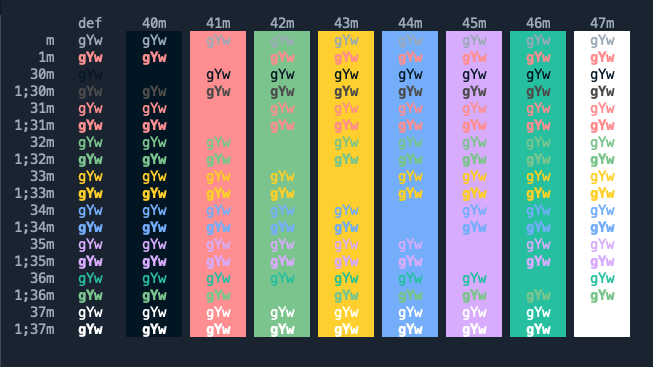

# Mirage for iTerm2

A port of Tristan Remy's [Mirage VS Code theme](https://github.com/tristanremy/mirage) for iTerm2.

## Installation

1. [Download Mirage for iTerm2](https://github.com/gomah/mirage-iterm/archive/master.zip).
2. Install [iTerm2](https://www.iterm2.com/).
3. Launch iTerm2.
4. Press <kbd>Cmd</kbd>+<kbd>,</kbd> to open preferences.
5. Visit Profiles → [Your Profile Name] → Colors.
6. Choose “Import…” from the “Color Presets” drop-down.
7. Import the `Mirage.itermcolors` file.
8. Choose “Mirage” from the Color Presets.
9. Repeat step eight for each profile you’d like to use Mirage for.

## Updating

1. [Download Mirage for iTerm2](https://github.com/gomah/mirage-iterm/archive/master.zip).
2. Open iTerm2. 
3. Visit Profiles → [Your Profile] → Colors.
4. Choose “Delete Preset…” from the “Color Presets” drop-down.
5. Delete the Mirage preset.
6. Choose “Import…” from the “Color Presets” drop-down.
7. Import the `Mirage.itermcolors` file.
8. Choose “Mirage” from the Color Presets. 
